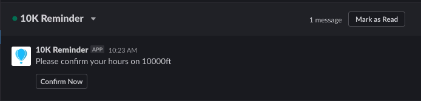
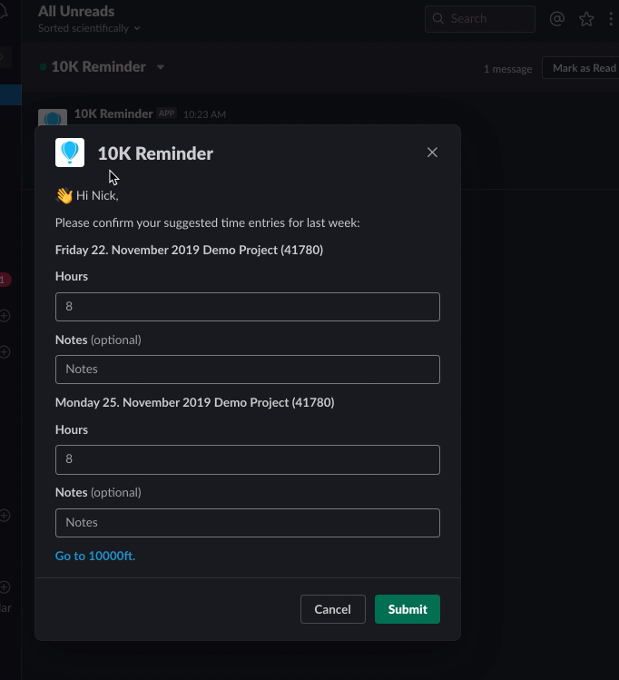
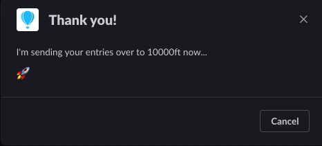
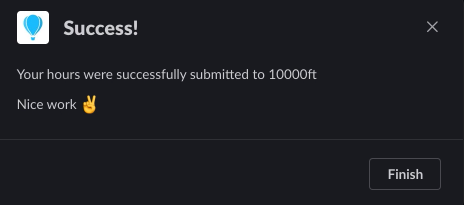
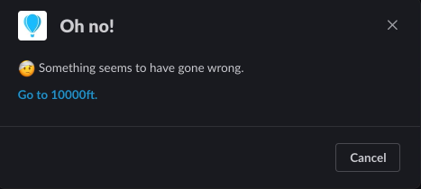
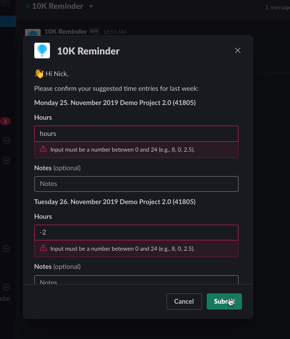

# Susi: Third Party Extension for Slack / 10000ft

Susi is a middleware (so-to-say) for [Slack](https://slack.com) and [10000ft](https://github.com/10Kft/10kft-api). A Node script is configured to periodically check an organization's time entries on 10000ft and uses a Slack bot to:
  * directly message employees when they have unconfirmed time entries
  * provide an interactive modal through which they can view their suggested time entries and confirm them, or alter them and then confirm them, all without ever having to leave Slack.

The structure of this repository is one main script (`app.js`), one internal API (`server.js`), a few service scripts in the *services* directory for interacting with the Slack and 10000ft APIs (respectively, `slack.js` and `tenK.js`) and for tunneling HTTP requests (`ngrok.js`) from Slack to our API. In addition, the *forever* directory contains a config file for the Node process manager [forever](https://www.npmjs.com/package/forever). 

# Table of Contents

* [Installation](#Installation)
* [Configuration](#Configuration)
* [Launch](#Launch)
* [Authorization](#Authorization)
* [Screenshots](#Screenshots)
* [Open Development Tasks](#Open-Development-Tasks)

# Installation

This package was written to use as few dependencies as possible, yet a few are required. After cloning, run 

`npm install` 

to install:

* [@slack/web-api](https://slack.dev/node-slack-sdk/web-api)
* [body-parser](https://www.npmjs.com/package/body-parser)
* [cron](https://www.npmjs.com/package/cron)
* [dotenv](https://www.npmjs.com/package/dotenv)
* [express](https://www.npmjs.com/package/express)
* [ngrok](https://ngrok.com/)
* [request-promise](https://www.npmjs.com/package/request-promise)

Feel free to use the Yarn package manager at your own risk. There is room for improvement in terms of limiting dependencies. 

# Configuration

First and foremost, it is necessary to serve `server.js` at a publicly available URL. Your Slack app's `Request URL` must be set to this URL. See the [Slack API documentation](https://api.slack.com/messaging/interactivity#components) on interactivity for more. 

Beyond that, the script is configurable across the following entrypoints:

## .env

The `.env` file contains your service authorization tokens. You will need to add your tokens here and change the name of the file from `.env.example` to `.env` after cloning. 

## whitelist.js

The `whitelist.js` exports an array of email addresses that will be used to define which members of the Slack workspace will receive notifications upon the script's execution. Note this only has an effect if the launch mode is `dev` or `beta`. In the production launch mode, no whitelist is configured to be used.

## cron (app.js)

Cron is used to schedule execution of the `main()` function in `app.js`. The Cron job runs on Berlin time by default.

## forever/config.json

This file contains configuration for the Node process manager forever.

# Launch

```forever start forever/config.json```


# Authorization

Whereas an authorization token is always included in the header of each HTTP request made to the 10000ft API, a Slack web client is initialized with an authorization token and then methods on the client are called after that (`slack.js`) or authorization tokens are passed in the HTTP request headers (`server.js`). Slack token authorization should be uniformized and updated to the more secure 'signed-secrets' paradigm in a future commit.

Store your tokens in `.env`. [See here for more.](#env)

# Screenshots

A user will receive a message from the slack bot like this: 



When they click/tap 'Confirm Now', a personalized modal will open with the suggested time entries for last week that they have not confirmed, with placeholder text in the 'Hours' fields that display their assigned hours for that day of whatever project. Optional 'Notes' fields are present for each suggestion:



While the bot is POSTing to 10000Ft via our server.js REST API, the modal view will be replaced with the following:



If successful, the modal view will switch to: 



or, if not, to this:



Note that the user will be prevented from submitting incompatable data in the hours fields thusly: 




# Open Development Tasks

Please cross-reference what you read below with the current [Issues](https://github.com/nick-bratton/susi/issues).

* [Process Management](#process-management)
* [Handling Pagination](#handling-pagination)
* [Handling Errors](#handling-errors)
* [Upgrading Slack Authorization Paradigm](#upgrading-slack-authorization-paradigm)
* [Refactoring Calls To Slack API](#refactoring-calls-to-slack-api)

## Handling Pagination

[Paginated responses](https://github.com/10Kft/10kft-api/blob/master/sections/first-things-first.md#pagination) from 10000ft are not currently handled. For the time being, when requesting Time Entries from their API, the `per_page` parameter is set in the HTTP request URI to 500: `"&per_page=500"`.

## Handling Errors

Errors should be caught and thrown at this point, but retrying should be implemented. 

## Upgrading Slack Authorization Paradigm

As mentioned above, token authorization is 'outmoded'. Slack now recommends [using signed-secrets](https://api.slack.com/docs/verifying-requests-from-slack). 

## Refactoring Calls to Slack API

Calls to the Slack API happen in both `slack.js` and `server.js`. When possible, this functionality should be compartamentalized. Exports should be used to make these calls from the `server.js`.

## Process Management

Forever is currently used but there is no non-default logging and reporting implemented. On first production run, the scripts stopped executing without forever reporting them as stopped. Tests should be written and process management utils like logs/reports should be programmed. 